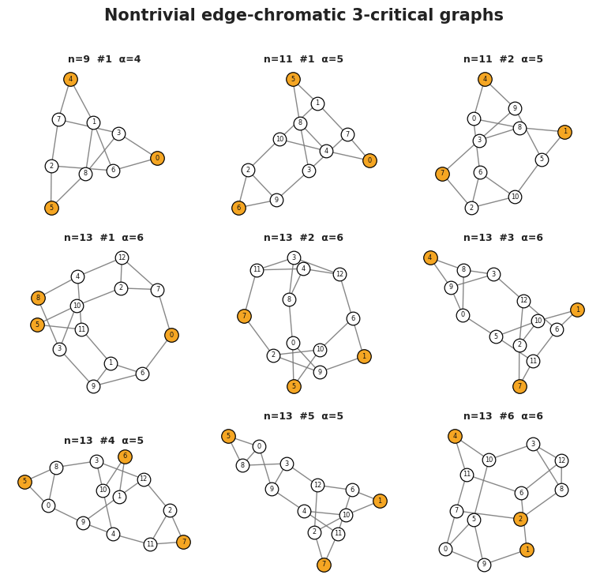

# Data and code for "Exploring the world of edge-chromatic 3-critical graphs"

[](https://opensource.org/licenses/MIT)
[](https://github.com/chenle02/edge-3-critical-graphs-data/releases)
[](https://github.com/chenle02/edge-3-critical-graphs-data/actions/workflows/verify.yml)
[](https://chenle02.github.io/edge-3-critical-graphs-data/)
[](https://doi.org/10.5281/zenodo.20821990)



**Website & interactive graph explorer:** <https://chenle02.github.io/edge-3-critical-graphs-data/>

This repository archives the census data, machine-readable audit reports, and
search/audit code referenced in the paper

> Le Chen and Songling Shan,
> *Exploring the world of edge-chromatic 3-critical graphs*, 2026.

A graph with maximum degree 3 is (edge-chromatic) **3-critical** if it is
connected, has chromatic index 4, and deleting any edge lowers the chromatic
index to 3.  A 3-critical graph is **nontrivial** if it contains no
3-overfull subgraph.  The paper determines the numbers of nontrivial
3-critical graphs for all orders through 22 — in particular the odd orders
15 through 21 — records complete computer censuses at orders 19 and 21, and
reproduces the known order-22 count of Brinkmann and Steffen.  Beyond
enumeration, the paper proves a **characterization theorem** for all
nontrivial 3-critical graphs in terms of three operations (vertex-blowup,
Haj\u00f3s-join, Meredith-type extension, and snark-completion), and this
repository's classification script reproduces the resulting categorization
of every survivor.

## Quickstart

```python
import json, gzip, networkx as nx

# load a census file (.json, or gzip.open(..., "rt") for .json.gz)
data = json.load(open("results/order_13_delta_3.json"))
print(data["survivor_count"], "nontrivial survivors at order", data["order"])

# rebuild any survivor as a networkx graph from its edge list
G = nx.Graph(); G.add_edges_from(data["survivors"][0]["edges"])
print("example survivor:", G)
```

Browse every order interactively (live graph rendering) on the
[website](https://chenle02.github.io/edge-3-critical-graphs-data/).

## Layout

```
results/   complete census output files, orders 4 through 22
reports/   machine-readable audit reports cited in the paper
code/      search pipeline and audit scripts
```

## Census files (`results/`)

Each `order_n_delta_3.json` (or `.json.gz`) records the full census run at
order `n`: number of generated 2-connected subcubic graphs, number of
3-critical graphs, number of overfull ones, and the list of nontrivial
survivors in graph6 format.  SHA-256 hashes of the files backing the paper's
headline counts:

| File | Survivors | SHA-256 |
|---|---:|---|
| `order_13_delta_3.json` | 14 | `799aae0712bfb53b10279cdb178abd9ae2b55924f134d2fd3f9154ad4527ef10` |
| `order_15_delta_3.json` | 94 | `c5c391d32a4019a6765e236ac9bfbd292572722073fbb72312d4ecbf91293162` |
| `order_17_delta_3.json` | 774 | `c7447e9626f53cdb8a381376ec76eb95a58368bab85dd16dd02ba6d4f7b9a269` |
| `order_19_delta_3.json` | 6,984 | `9f4eff7e13636fce3bcd3fc69cd2a3dfb36f1ad80e01656509fc6b9927f92b1e` |
| `order_20_delta_3.json.gz` | 0 | `08e25a09ecdedd06b8904342203307ad71728aa609f5469d160ac9ce32ac8ed0` |
| `order_21_delta_3.json.gz` | 70,530 | `2f9c3e46d744dc0b62a95631e050af657806ec76ae03a286f7e845c69cff24db` |
| `order_22_delta_3.json.gz` | 1 | `57dbfccd9cb352564f5422530c9a0b7e269148c9789bf040f0dfd7ab96ed553e` |

The hashes for `order_20`, `order_21`, and `order_22` are of the compressed files, as
archived here and as recorded during the original runs.

## Audit reports (`reports/`)

Reports are archived exactly as produced by the audit runs (provenance
copies; JSON is the canonical record, Markdown siblings are human-readable
summaries).  The reports supporting the paper:

| Paper reference | File(s) |
|---|---|
| Census categorization by characterization clauses (Table in the paper) | `census_characterization_classification.json`, `census_characterization_classification.md` |
| Order-13 construction classification | `order13_triangle_blowup_classification.json`, `delta3_blowup_chain_9_11_13.json` |
| Order-15/17 construction passes | `songling_order15_order17_generation_verification.json`, `..._second_pass.json`, `..._third_pass_hajos.json` |
| Residual records | `songling_remaining_residue_dossier.json` |
| Even-order snark-residue audit (orders < 18) | `even_snark_residue_audit_below18.json` |
| Snark-deletion comparisons | `songling_snark_critical_subgraph_audit.json`, `songling_order17_snark_candidate_audit.json`, `songling_sve_hajos_followup_audit_20260505.*` |
| Cyclic 3-cut side characterization ledger | `songling_h_characterization_ledger_20260602_ledger.json` |

## Code (`code/`)

- `code/critical_graph_search/` and `code/main.py`: the census pipeline
  (graph generation via `geng` from the nauty suite, pruning filters,
  bitmask backtracking edge-coloring, criticality and overfull tests).
- `code/scripts/classify_census_characterization.py`: the deterministic
  census post-processor that classifies every nontrivial survivor by the
  first applicable clause (a) vertex-blowup, (b) Haj\u00f3s-join, (c)
  Meredith-type, (d)/(e) snark-completion of the characterization theorem,
  and asserts that the five categories partition each order exactly. It
  reproduces the categorization table in the paper:
  ```bash
  python3 code/scripts/classify_census_characterization.py --orders 13 15 17 19 21 22
  ```
- `code/scripts/audit_songling_snark_critical_subgraphs.py`,
  `code/scripts/audit_songling_even_snark_residue_below18.py`,
  `code/scripts/audit_songling_cyclic3_kempe_chain_request.py`: snark- and
  cyclic-3-cut audits supporting the snark-completion clauses.
- `code/scripts/check_hashes.py`: recompute and verify the census SHA-256
  hashes recorded above.
- `code/scripts/export_explorer_data.py`, `code/scripts/render_graphs.py`:
  data export for the website explorer and figure rendering.

The audit scripts are archived as run; some refer to paths in the private
research repository where they were executed. The census pipeline, the
classification script, and the hash check run against this repository alone.

## Reproducibility and environment

Tested toolchain:

- **Python** 3.10-3.12 (continuous integration runs on 3.11).
- **Python packages** (see [`code/requirements.txt`](code/requirements.txt)):
  `networkx>=3.0`, `numpy>=1.24`; `matplotlib>=3.7` (figures) and
  `pytest>=7.0` (tests) are optional.
- **External tool:** graph generation calls **`geng` from nauty 2.8.9**
  (install via `apt install nauty`, `brew install nauty`, or from
  <https://pallini.di.uniroma1.it/>). The verifier and hash checks do not
  need nauty.

Set up and verify the paper's census claims:

```bash
python3 -m pip install -r code/requirements.txt
# Confirm the archived census files match the recorded SHA-256 hashes:
python3 code/scripts/check_hashes.py --readme README.md --results-dir results
```

Census generation at order `n` uses the exact invocation
`geng -Cq -d2 -D3 n` (2-connected, minimum degree >= 2, maximum degree <= 3);
the driver is `code/main.py`. The per-order JSON files under `results/` are the
manuscript-facing records, and their SHA-256 hashes (above) are the source of
truth tying each file to the counts reported in the paper.

## Use of AI tools

In the spirit of the [SIAM Editorial Policy on Artificial
Intelligence](https://epubs.siam.org/artificial-intelligence) and for full
transparency, we record that AI-based tools (large language models and AI
coding assistants) were used to help develop, debug, and document the search
and audit code in this repository, and to assist with drafting the manuscript.
The candidate graphs were generated by `geng` from the nauty suite, and the
census, criticality, and overfull results were produced by the code archived
here. The authors reviewed, tested, and verified all AI-assisted code; the
SHA-256 hash check above lets any reader confirm the census files behind the
paper's counts directly from this repository. The authors assume responsibility
for all content.

## The order-25 witness

The impossibility theorem's witness is the order-25 graph with graph6 string

```
X???C@?K@OOae?DOGP@D?QO?C????G??G??A?G?G??A_??P?_?@
```

Run `python3 code/scripts/independent_verify_order25_witness.py` to check
all of its claimed properties end to end.

## Acknowledgment

This work was completed in part with resources provided by the Auburn University Easley Cluster.

## License

MIT (see LICENSE).
