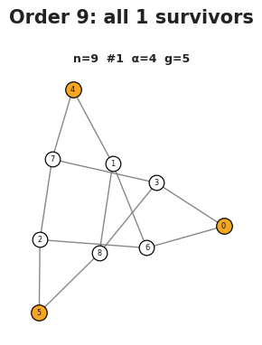
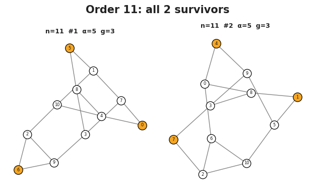
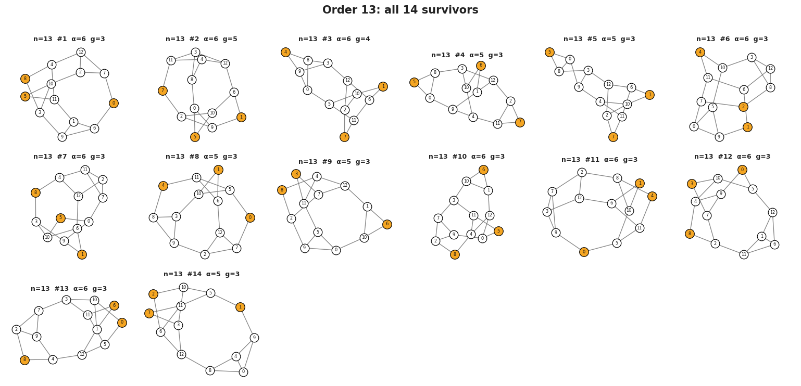
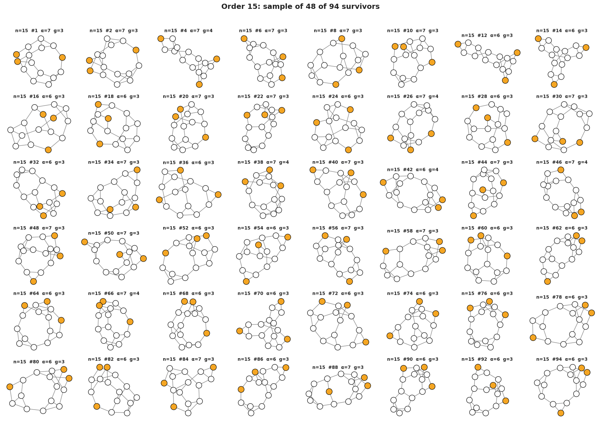
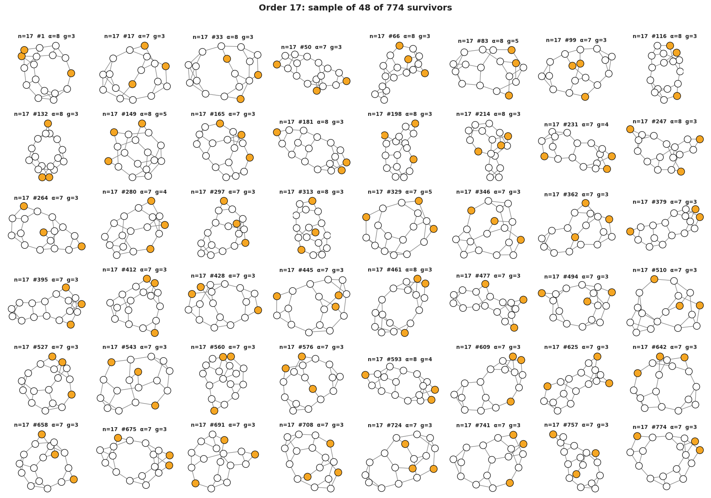
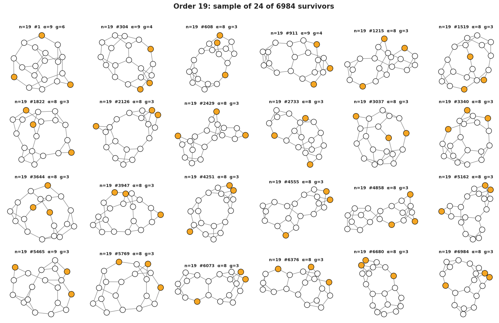
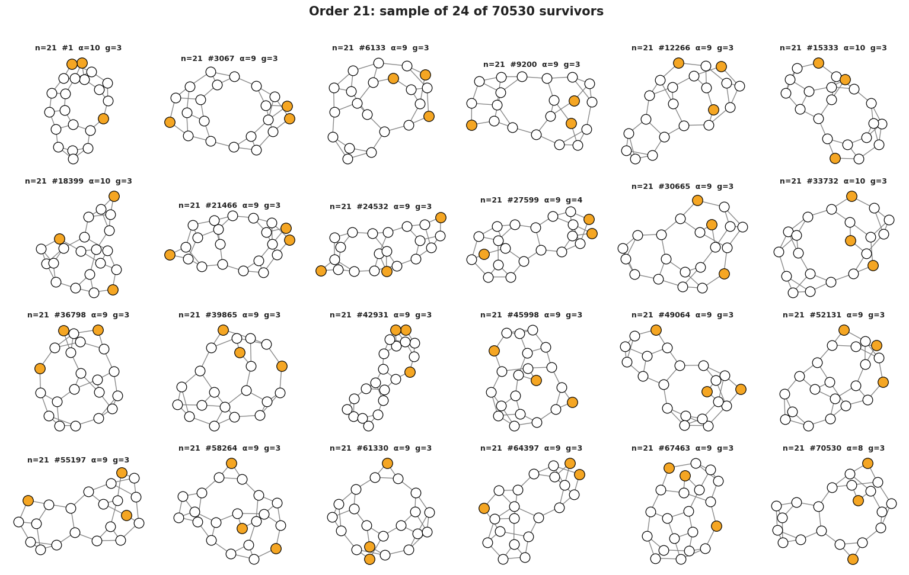
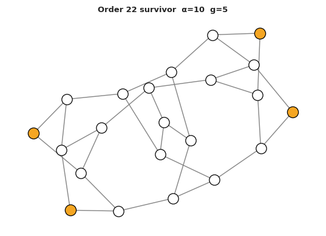

# Results

Each section below gives the nontrivial-survivor count, links to the corresponding census file in the public repository, and the gallery image rendered from that file. For orders with many survivors the gallery shows a representative sample; the panel title records how many of the total are displayed.

The [Interactive explorer](explorer.md) provides a browser-based entry point for browsing the same census.

## Order 9

- Nontrivial survivors: **0**
- Census file: [`order_9_delta_3.json`](https://github.com/chenle02/edge-3-critical-graphs-data/blob/master/results/order_9_delta_3.json)
- Explorer: [Interactive explorer](explorer.md)

## Order 11

- Nontrivial survivors: **0**
- Census file: [`order_11_delta_3.json`](https://github.com/chenle02/edge-3-critical-graphs-data/blob/master/results/order_11_delta_3.json)
- Explorer: [Interactive explorer](explorer.md)

## Order 13

- Nontrivial survivors: **14**
- Census file: [`order_13_delta_3.json`](https://github.com/chenle02/edge-3-critical-graphs-data/blob/master/results/order_13_delta_3.json)
- Explorer: [Interactive explorer](explorer.md)

## Order 15

- Nontrivial survivors: **94**
- Census file: [`order_15_delta_3.json`](https://github.com/chenle02/edge-3-critical-graphs-data/blob/master/results/order_15_delta_3.json)
- Explorer: [Interactive explorer](explorer.md)

## Order 17

- Nontrivial survivors: **774**
- Census file: [`order_17_delta_3.json`](https://github.com/chenle02/edge-3-critical-graphs-data/blob/master/results/order_17_delta_3.json)
- Explorer: [Interactive explorer](explorer.md)

## Order 19

- Nontrivial survivors: **6,984**
- Census file: [`order_19_delta_3.json.gz`](https://github.com/chenle02/edge-3-critical-graphs-data/blob/master/results/order_19_delta_3.json.gz)
- Explorer: [Interactive explorer](explorer.md)

## Order 21

- Nontrivial survivors: **70,530**
- Census file: [`order_21_delta_3.json.gz`](https://github.com/chenle02/edge-3-critical-graphs-data/blob/master/results/order_21_delta_3.json.gz)
- Explorer: [Interactive explorer](explorer.md)

## Order 22

- Nontrivial survivors: **1**
- Census file: [`order_22_delta_3.json`](https://github.com/chenle02/edge-3-critical-graphs-data/blob/master/results/order_22_delta_3.json)
- Explorer: [Interactive explorer](explorer.md)

